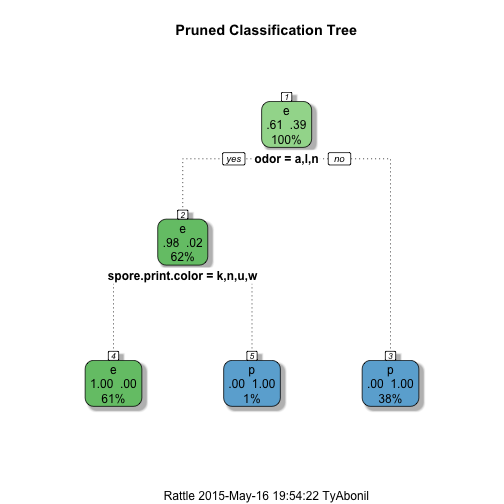

### The Problem

The goal is to create a web app that ascertains whether a given mushroom is edible or poisonous, given qualitative description of its physical characteristics.

[The Mushroom Data Set (MDS)](https://archive.ics.uci.edu/ml/datasets/Mushroom) is a multivariate collection of 8124 instances of mushroom descriptions, each of 22 discrete attributes, including a classification of whether a mushroom is edible or poisonous.  22 features is daunting.
-  Bache, K. & Lichman, M. (2013). [UCI Machine Learning Repository](http://archive.ics.uci.edu/ml). Irvine, CA: University of California, School of Information and Computer Science.


To tackle the problem:
- The features must be reduce without impacting accuracy of classification
- The model must be very accurate as an incorrect classifcation can be deadly


The file is read and, using the schema provided on the UCI website, names are assigned. NA values are omitted and 50/50 test and training sets are created. Please see the source file for details. 


--- &twocol

### Reducing Featureset
We opt to use the rpart package to grow a decision tree to find the most valuable features.  First, we create a tree with all possible features, then we prune the tree to find the ones which minimize the CP hyper parameter - a measure of the 100-fold cross-validated error.

*** {name: left}


 

```
## Error in rpartco(x): no information available on parameters from previous call to plot()
```

*** {name: right}

 

```
## Error in rpartco(x): no information available on parameters from previous call to plot()
```

It is osberved that pruning down to two features has no effect on the tree.

---

### The ANN Model


It is observed that "odor" and "spore.print.color" account for almost all of the variance in the final classification.  An ANN is trained using these values:


```r
mush.frm <- edible ~ odor + spore.print.color
mush.trained <- train(as.formula(mush.frm), data=mush.train, method = "nnet", 
                      maxit = 100,  trace = F)
```

We see that the best ANN is at size ``1`` and decay ``0.1``.


```r
mush.fit <- nnet(as.formula(mush.frm), data=mush.train, method = "nnet", 
                 maxit = 100,  trace = F, size=1, decay=0.1)
```

---

### The Validation Test

Using the validation set, the accuracy of the model is tested:


```r
success.rate <- sum(
  predict(
    mush.fit, newdata=mush.test, type="class") == mush.test[,1]
  )/nrow(mush.test) * 100
success.rate
```

```
## [1] 100
```

The success rate is found to be 100%!  This is a very strong model, so we can use it to predict whether a mushroom is poisonous or not.
